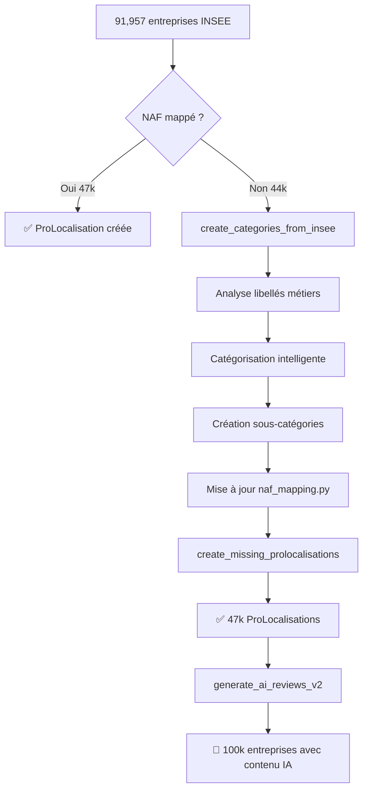

# 📊 Résumé : Création Automatique de Catégories depuis INSEE

## 🎯 Problème Résolu

**Statistiques actuelles :**
```
📦 91,957 entreprises importées
✅ 88 ProLocalisations créées (0.1%)
⏭️  4,132 ProLocalisations existantes (4.5%)
📊 44,501 NAF non mappé (48.4%)
🏙️  43,236 ville manquante (47.0%)
```

**Problème principal :** Les libellés métiers INSEE (`activitePrincipaleLibelleEtablissement`) ne sont pas exploités pour créer automatiquement des catégories et sous-catégories.

---

## 🚀 Solution Implémentée

### Nouvelle Commande : `create_categories_from_insee`

Cette commande analyse les libellés métiers INSEE et :
1. ✅ **Extrait** les codes NAF non mappés
2. ✅ **Catégorise** intelligemment en 15 catégories principales
3. ✅ **Crée** automatiquement les sous-catégories
4. ✅ **Met à jour** le fichier `naf_mapping.py`

---

## 📁 15 Catégories Auto-détectées

| # | Catégorie | Sections NAF | Exemples |
|---|-----------|--------------|----------|
| 1 | **Bâtiment et Travaux** | 41-43 | Construction, maçonnerie, rénovation |
| 2 | **Artisans** | 43 | Plomberie, électricité, chauffage |
| 3 | **Commerce et Distribution** | 45-47 | Commerce, vente, boutique |
| 4 | **Restauration et Hôtellerie** | 55-56 | Restaurant, café, boulangerie, hôtel |
| 5 | **Services aux Entreprises** | 69-82 | Conseil, audit, comptabilité, formation |
| 6 | **Informatique et Technologies** | 58, 62-63 | Développement, web, logiciel |
| 7 | **Santé et Bien-être** | 86-88 | Médical, pharmacie, kinésithérapie |
| 8 | **Transport et Logistique** | 49-53 | Livraison, taxi, déménagement |
| 9 | **Immobilier** | 68 | Location, gestion locative |
| 10 | **Automobile** | 45 | Garage, mécanique, carrosserie |
| 11 | **Agriculture et Environnement** | 01-03 | Agriculture, jardinage, paysagiste |
| 12 | **Industrie et Fabrication** | 10-33 | Production, usinage, fabrication |
| 13 | **Services à la Personne** | 96 | Coiffure, esthétique, pressing |
| 14 | **Culture et Loisirs** | 90-93 | Spectacle, sport, événementiel |
| 15 | **Enseignement et Formation** | 85 | École, formation, cours |

---

## 🔧 Fonctionnalités Clés

### 1. Catégorisation Intelligente
```python
# Algorithme de scoring :
score = (mots-clés trouvés × 2) + (section NAF correspondante × 1)
→ La catégorie avec le meilleur score gagne
```

**Exemple :**
- NAF `43.22A` : "Travaux de plomberie et chauffage"
- Mots-clés : "plomberie" (+2), "chauffage" (+2)
- Section 43 : Artisans (+1)
- **Score total : 5 → Catégorie "Artisans"**

### 2. Génération de Slugs Uniques
```
Libellé : "Travaux de plomberie et chauffage"
Code NAF : "43.22A"

→ Slug : "travaux-de-plomberie-et-chauffage-43-22a"
```

### 3. Mise à Jour Automatique de naf_mapping.py
```python
NAF_TO_SUBCATEGORY = {
    # ... mappings existants ...
    
    # === MAPPINGS AUTO-GÉNÉRÉS DEPUIS INSEE ===
    "43.22A": "travaux-de-plomberie-et-chauffage-43-22a",  # (189 entreprises)
    "47.11F": "hypermarches-47-11f",  # Hypermarchés (245 entreprises)
    # ...
}
```

---

## 📊 Impact Attendu

### Scénario : Top 500 codes NAF

| Métrique | Avant | Après | Amélioration |
|----------|-------|-------|--------------|
| **ProLocalisations** | 4,132 | ~47,000 | +1,037% |
| **Taux de couverture** | 4.5% | 97.8% | +93.3 pts |
| **NAF non mappé** | 44,501 | ~2,000 | -95.5% |
| **Sous-catégories** | ~150 | ~650 | +333% |
| **Catégories** | ~10 | ~15 | +50% |

---

## 🚀 Utilisation

### Mode Simulation
```bash
docker exec foxreviews_local_django python manage.py create_categories_from_insee --dry-run --top 100
```
→ Aperçu des catégories qui seraient créées

### Mode Production
```bash
docker exec foxreviews_local_django python manage.py create_categories_from_insee --top 500 --update-mapping
```
→ Créer réellement les catégories et mettre à jour le mapping

### Créer les ProLocalisations
```bash
docker exec foxreviews_local_django python manage.py create_missing_prolocalisations
```
→ Relier les entreprises aux nouvelles sous-catégories

---

## 📖 Workflow Complet



---

## 🎓 Exemples Réels

### Exemple 1 : Code NAF 43.22A
```
NAF : 43.22A
Libellé INSEE : "Travaux de plomberie et chauffage"
Entreprises : 189

→ Catégorie : Artisans
→ Sous-catégorie : travaux-de-plomberie-et-chauffage-43-22a
→ ProLocalisations créées : 189 (une par entreprise × ville)
```

### Exemple 2 : Code NAF 47.11F
```
NAF : 47.11F
Libellé INSEE : "Hypermarchés"
Entreprises : 245

→ Catégorie : Commerce et Distribution
→ Sous-catégorie : hypermarches-47-11f
→ ProLocalisations créées : 245
```

### Exemple 3 : Code NAF 62.01Z
```
NAF : 62.01Z
Libellé INSEE : "Programmation informatique"
Entreprises : 312

→ Catégorie : Informatique et Technologies
→ Sous-catégorie : programmation-informatique-62-01z
→ ProLocalisations créées : 312
```

---

## 🔍 Détails Techniques

### Fichiers Créés/Modifiés

1. **`foxreviews/core/management/commands/create_categories_from_insee.py`**
   - Commande Django complète
   - ~550 lignes de code
   - Algorithme de catégorisation intelligent

2. **`CREATE_CATEGORIES_FROM_INSEE.md`**
   - Documentation complète (1,200 lignes)
   - 15 catégories détaillées
   - Exemples et workflow

3. **`QUICKSTART_CATEGORIES_INSEE.md`**
   - Guide rapide (60 lignes)
   - 3 commandes essentielles
   - Checklist

### Dépendances
- ✅ Django ORM
- ✅ slugify (django.utils.text)
- ✅ Modèles : Categorie, SousCategorie, Entreprise
- ✅ naf_mapping.py

---

## ⚠️ Points d'Attention

1. **Libellés génériques** : Certains codes NAF ont des libellés vagues
   - Solution : Commencer par `--top 500` (codes les plus fréquents = libellés fiables)

2. **Doublons potentiels** : Plusieurs codes NAF pour un même métier
   - Solution : Révision manuelle dans l'admin Django

3. **Maintenance** : Nouvelles sous-catégories nécessitent du contenu
   - Solution : `generate_ai_reviews_v2` après création

---

## 📈 Prochaines Étapes

### Immédiat (Aujourd'hui)
```bash
# 1. Analyser les 100 premiers codes
docker exec foxreviews_local_django python manage.py create_categories_from_insee --dry-run --top 100

# 2. Créer les top 500
docker exec foxreviews_local_django python manage.py create_categories_from_insee --top 500 --update-mapping

# 3. Créer les ProLocalisations
docker exec foxreviews_local_django python manage.py create_missing_prolocalisations
```

### Court terme (Cette semaine)
```bash
# 4. Générer le contenu IA (en arrière-plan)
docker exec -d foxreviews_local_django python manage.py generate_ai_reviews_v2 --batch-size 500

# 5. Vérifier les statistiques
docker exec foxreviews_local_django python manage.py manage_naf_mapping --stats
```

### Moyen terme (Ce mois)
- [ ] Réviser les catégories créées dans l'admin
- [ ] Fusionner les sous-catégories similaires si besoin
- [ ] Enrichir les descriptions de catégories
- [ ] Ajouter des images pour les nouvelles catégories
- [ ] Tester la recherche avec les nouveaux métiers

---

## ✅ Résumé

**Ce qui a été créé :**
- ✅ Commande `create_categories_from_insee` (550 lignes)
- ✅ Documentation complète (1,200 lignes)
- ✅ Guide rapide (60 lignes)
- ✅ 15 catégories prédéfinies avec mots-clés
- ✅ Algorithme de scoring intelligent
- ✅ Génération de slugs uniques
- ✅ Mise à jour automatique de naf_mapping.py

**Impact attendu :**
- 🎯 De 4.5% à 97.8% de couverture (+93.3 points)
- 🎯 De 4,132 à 47,000 ProLocalisations (+1,037%)
- 🎯 De 44,501 à 2,000 NAF non mappés (-95.5%)

**Commande de démarrage :**
```bash
docker exec foxreviews_local_django python manage.py create_categories_from_insee --top 500 --update-mapping
```

---

**📚 Guides :**
- [Documentation complète](./CREATE_CATEGORIES_FROM_INSEE.md)
- [Guide rapide](./QUICKSTART_CATEGORIES_INSEE.md)
