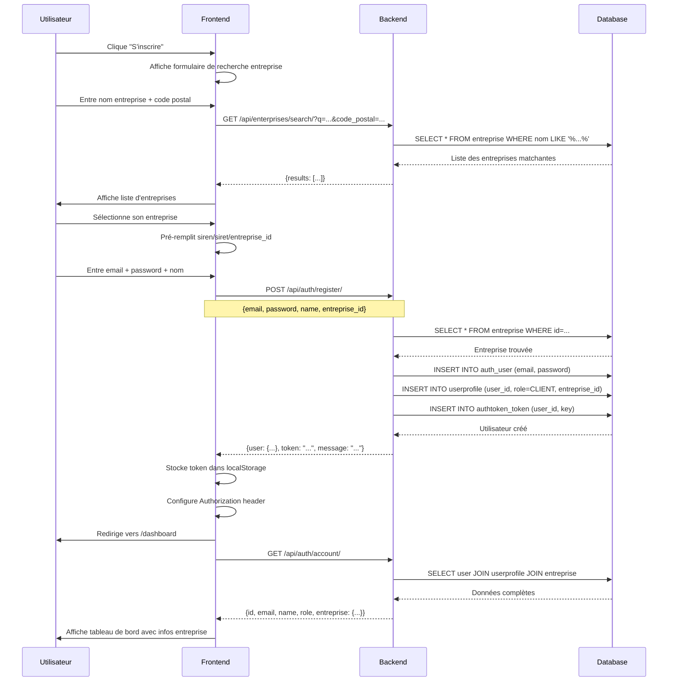

# 📘 Documentation - Création de Compte Client avec Entreprise

## 🎯 Architecture du système

### Modèle de données
```
User (Django Auth)
  ↓ 1:1
UserProfile (role: CLIENT, ADMIN, etc.)
  ↓ N:1
Entreprise (siren, siret, nom, etc.)
  ↓ 1:N
ProLocalisation (sous_categorie + ville)
  ↓ 1:N
Subscription (abonnements Stripe)
```

### ⚠️ RÈGLE IMPORTANTE

**Un client DOIT avoir une entreprise avant de pouvoir s'inscrire.**

Le système fonctionne ainsi :
1. ✅ L'entreprise existe déjà dans la base (4.5M+ entreprises importées depuis INSEE)
2. ✅ L'utilisateur s'inscrit en fournissant SIREN ou SIRET
3. ✅ Le système lie automatiquement le compte à l'entreprise
4. ✅ Le client peut ensuite créer des sponsorisations pour ses ProLocalisations

---

## 📋 Flux d'inscription complet

### Étape 1 : Rechercher son entreprise

**Endpoint** : `GET /api/enterprises/search/`

Le frontend doit d'abord permettre à l'utilisateur de trouver son entreprise.

#### Request
```http
GET /api/enterprises/search/?q=Aurelien+Cave&code_postal=65380
```

**Paramètres** :
| Paramètre | Type | Description |
|-----------|------|-------------|
| `q` | String | Nom de l'entreprise (min 3 caractères) |
| `code_postal` | String | Code postal (optionnel, améliore la précision) |

#### Response Success (200)
```json
{
  "results": [
    {
      "id": "uuid-entreprise-1",
      "siren": "753896356",
      "siret": "75389635600023",
      "nom": "AURELIEN CAVE",
      "nom_commercial": null,
      "adresse": "12 RUE EXEMPLE",
      "code_postal": "65380",
      "ville_nom": "LANNE",
      "naf_code": "43.21Z"
    }
  ],
  "count": 1
}
```

**Interface Frontend recommandée** :
```vue
<template>
  <div class="enterprise-search">
    <h3>Recherchez votre entreprise</h3>
    
    <input 
      v-model="searchQuery" 
      @input="searchEnterprise"
      placeholder="Nom de votre entreprise"
    />
    
    <input 
      v-model="codePostal" 
      @input="searchEnterprise"
      placeholder="Code postal (optionnel)"
    />
    
    <div v-if="enterprises.length" class="results">
      <div 
        v-for="ent in enterprises" 
        :key="ent.id"
        @click="selectEnterprise(ent)"
        class="enterprise-item"
      >
        <strong>{{ ent.nom }}</strong>
        <p>SIREN: {{ ent.siren }} | SIRET: {{ ent.siret }}</p>
        <p>{{ ent.adresse }}, {{ ent.code_postal }} {{ ent.ville_nom }}</p>
      </div>
    </div>
    
    <p v-else-if="searched && !enterprises.length" class="no-results">
      ❌ Aucune entreprise trouvée. Vérifiez le nom ou le code postal.
    </p>
  </div>
</template>

<script>
export default {
  data() {
    return {
      searchQuery: '',
      codePostal: '',
      enterprises: [],
      searched: false
    }
  },
  methods: {
    async searchEnterprise() {
      if (this.searchQuery.length < 3) {
        this.enterprises = [];
        return;
      }
      
      try {
        const params = { q: this.searchQuery };
        if (this.codePostal) params.code_postal = this.codePostal;
        
        const response = await this.$api.get('/api/enterprises/search/', { params });
        this.enterprises = response.data.results;
        this.searched = true;
      } catch (error) {
        console.error('Erreur recherche entreprise:', error);
      }
    },
    
    selectEnterprise(enterprise) {
      this.$emit('enterprise-selected', enterprise);
    }
  }
}
</script>
```

---

### Étape 2 : Inscription avec entreprise

**Endpoint** : `POST /api/auth/register/`

Une fois l'entreprise sélectionnée, l'utilisateur peut s'inscrire.

#### 🔐 Authentification
```
Aucune (AllowAny)
```

#### 📤 Request Body - Option 1 : Avec ID entreprise (recommandé)
```json
{
  "email": "contact@aurelien-cave.fr",
  "password": "MonMotDePasseSécurisé123!",
  "name": "Aurélien Cave",
  "entreprise_id": "uuid-entreprise-1"
}
```

#### 📤 Request Body - Option 2 : Avec SIREN
```json
{
  "email": "contact@aurelien-cave.fr",
  "password": "MonMotDePasseSécurisé123!",
  "name": "Aurélien Cave",
  "siren": "753896356"
}
```

#### 📤 Request Body - Option 3 : Avec SIRET
```json
{
  "email": "contact@aurelien-cave.fr",
  "password": "MonMotDePasseSécurisé123!",
  "name": "Aurélien Cave",
  "siret": "75389635600023"
}
```

**Détails des paramètres** :
| Paramètre | Type | Requis | Description |
|-----------|------|--------|-------------|
| `email` | String (Email) | ✅ | Email unique de l'utilisateur |
| `password` | String | ✅ | Mot de passe (min 8 caractères) |
| `name` | String | ❌ | Nom complet de l'utilisateur |
| `entreprise_id` | UUID | ⚠️ | ID de l'entreprise (OU siren OU siret requis) |
| `siren` | String | ⚠️ | SIREN 9 chiffres (OU entreprise_id OU siret requis) |
| `siret` | String | ⚠️ | SIRET 14 chiffres (OU entreprise_id OU siren requis) |

**⚠️ VALIDATION** : Au moins UN des trois (entreprise_id, siren, siret) est OBLIGATOIRE.

#### ✅ Response Success (201)
```json
{
  "user": {
    "id": 123,
    "email": "contact@aurelien-cave.fr",
    "name": "Aurélien Cave"
  },
  "token": "a1b2c3d4e5f6g7h8i9j0...",
  "message": "Inscription réussie"
}
```

**Actions Frontend après succès** :
1. ✅ Stocker le token : `localStorage.setItem('auth_token', response.data.token)`
2. ✅ Configurer axios : `axios.defaults.headers.common['Authorization'] = 'Token ' + token`
3. ✅ Rediriger vers le tableau de bord : `this.$router.push('/dashboard')`

#### ❌ Erreurs possibles

##### 400 - Email déjà utilisé
```json
{
  "email": ["Cet email est déjà utilisé."]
}
```

##### 400 - Mot de passe invalide
```json
{
  "password": [
    "Ce mot de passe est trop court. Il doit contenir au minimum 8 caractères.",
    "Ce mot de passe est trop courant."
  ]
}
```

##### 400 - Entreprise non fournie
```json
{
  "non_field_errors": [
    "Veuillez fournir un SIREN/SIRET (ou un identifiant entreprise) pour lier votre compte."
  ]
}
```

##### 400 - Entreprise introuvable
```json
{
  "error": "Entreprise introuvable pour ce SIREN/SIRET. Veuillez vérifier vos informations."
}
```

##### 400 - SIREN invalide
```json
{
  "siren": ["Le SIREN doit contenir exactement 9 chiffres."]
}
```

##### 400 - SIRET invalide
```json
{
  "siret": ["Le SIRET doit contenir exactement 14 chiffres."]
}
```

---

### Étape 3 : Récupérer les infos du compte

**Endpoint** : `GET /api/auth/account/`

Après connexion, récupérer les informations complètes du compte.

#### 🔐 Authentification
```javascript
headers: {
  'Authorization': 'Token <auth_token>'
}
```

#### ✅ Response Success (200)
```json
{
  "id": 123,
  "email": "contact@aurelien-cave.fr",
  "name": "Aurélien Cave",
  "role": "CLIENT",
  "entreprise": {
    "id": "uuid-entreprise-1",
    "siren": "753896356",
    "siret": "75389635600023",
    "nom": "AURELIEN CAVE",
    "adresse": "12 RUE EXEMPLE",
    "code_postal": "65380",
    "ville_nom": "LANNE"
  },
  "created_at": "2025-12-27T10:30:00Z"
}
```

---

## 🔄 Flux complet - Diagramme



---

## 🎨 Composant Vue.js complet

### Composant : RegisterForm.vue

```vue
<template>
  <div class="register-container">
    <!-- Étape 1 : Recherche entreprise -->
    <div v-if="step === 1" class="step-enterprise">
      <h2>Trouvez votre entreprise</h2>
      
      <div class="form-group">
        <label>Nom de l'entreprise *</label>
        <input 
          v-model="search.nom" 
          @input="searchEnterprise"
          placeholder="Ex: AURELIEN CAVE"
        />
      </div>
      
      <div class="form-group">
        <label>Code postal (optionnel)</label>
        <input 
          v-model="search.codePostal" 
          @input="searchEnterprise"
          placeholder="Ex: 65380"
        />
      </div>
      
      <div v-if="searching" class="loading">
        🔍 Recherche en cours...
      </div>
      
      <div v-else-if="enterprises.length" class="results">
        <p class="results-count">{{ enterprises.length }} entreprise(s) trouvée(s)</p>
        <div 
          v-for="ent in enterprises" 
          :key="ent.id"
          @click="selectEnterprise(ent)"
          class="enterprise-card"
          :class="{ selected: form.entreprise_id === ent.id }"
        >
          <div class="ent-header">
            <strong>{{ ent.nom }}</strong>
            <span class="badge">{{ ent.siren }}</span>
          </div>
          <p class="ent-address">
            {{ ent.adresse }}<br>
            {{ ent.code_postal }} {{ ent.ville_nom }}
          </p>
          <p class="ent-siret">SIRET: {{ ent.siret }}</p>
        </div>
      </div>
      
      <p v-else-if="searched && !enterprises.length" class="no-results">
        ❌ Aucune entreprise trouvée. Vérifiez vos informations.
      </p>
      
      <button 
        @click="step = 2" 
        :disabled="!form.entreprise_id"
        class="btn-primary"
      >
        Continuer →
      </button>
    </div>
    
    <!-- Étape 2 : Inscription utilisateur -->
    <div v-else-if="step === 2" class="step-user">
      <h2>Créez votre compte</h2>
      
      <div class="selected-enterprise">
        <p>✅ Entreprise sélectionnée :</p>
        <strong>{{ selectedEnterprise.nom }}</strong>
        <p>{{ selectedEnterprise.siren }}</p>
        <button @click="step = 1" class="btn-link">Changer</button>
      </div>
      
      <div class="form-group">
        <label>Email professionnel *</label>
        <input 
          v-model="form.email" 
          type="email"
          placeholder="contact@entreprise.fr"
          :class="{ error: errors.email }"
        />
        <span v-if="errors.email" class="error-msg">{{ errors.email[0] }}</span>
      </div>
      
      <div class="form-group">
        <label>Mot de passe *</label>
        <input 
          v-model="form.password" 
          type="password"
          placeholder="Minimum 8 caractères"
          :class="{ error: errors.password }"
        />
        <span v-if="errors.password" class="error-msg">{{ errors.password[0] }}</span>
      </div>
      
      <div class="form-group">
        <label>Nom complet</label>
        <input 
          v-model="form.name" 
          placeholder="Votre nom et prénom"
        />
      </div>
      
      <div class="actions">
        <button @click="step = 1" class="btn-secondary">← Retour</button>
        <button 
          @click="register" 
          :disabled="loading"
          class="btn-primary"
        >
          <span v-if="loading">⏳ Inscription...</span>
          <span v-else>✅ S'inscrire</span>
        </button>
      </div>
      
      <p v-if="errors.non_field_errors" class="global-error">
        {{ errors.non_field_errors[0] }}
      </p>
    </div>
    
    <!-- Étape 3 : Succès -->
    <div v-else-if="step === 3" class="step-success">
      <div class="success-icon">✅</div>
      <h2>Inscription réussie !</h2>
      <p>Bienvenue {{ form.name || form.email }} 👋</p>
      <p>Redirection vers votre tableau de bord...</p>
    </div>
  </div>
</template>

<script>
import axios from 'axios';

export default {
  data() {
    return {
      step: 1,
      search: {
        nom: '',
        codePostal: ''
      },
      enterprises: [],
      selectedEnterprise: null,
      searched: false,
      searching: false,
      form: {
        email: '',
        password: '',
        name: '',
        entreprise_id: null
      },
      errors: {},
      loading: false
    }
  },
  
  methods: {
    async searchEnterprise() {
      if (this.search.nom.length < 3) {
        this.enterprises = [];
        this.searched = false;
        return;
      }
      
      this.searching = true;
      try {
        const params = { q: this.search.nom };
        if (this.search.codePostal) {
          params.code_postal = this.search.codePostal;
        }
        
        const response = await axios.get('/api/enterprises/search/', { params });
        this.enterprises = response.data.results || [];
        this.searched = true;
      } catch (error) {
        console.error('Erreur recherche:', error);
        this.$notify.error('Erreur lors de la recherche');
      } finally {
        this.searching = false;
      }
    },
    
    selectEnterprise(enterprise) {
      this.selectedEnterprise = enterprise;
      this.form.entreprise_id = enterprise.id;
    },
    
    async register() {
      this.loading = true;
      this.errors = {};
      
      try {
        const response = await axios.post('/api/auth/register/', this.form);
        
        // Stocker le token
        const token = response.data.token;
        localStorage.setItem('auth_token', token);
        
        // Configurer axios
        axios.defaults.headers.common['Authorization'] = `Token ${token}`;
        
        // Afficher succès
        this.step = 3;
        
        // Rediriger après 2 secondes
        setTimeout(() => {
          this.$router.push('/dashboard');
        }, 2000);
        
      } catch (error) {
        if (error.response?.data) {
          this.errors = error.response.data;
          
          // Afficher notification d'erreur
          const errorMsg = error.response.data.error || 
                          error.response.data.non_field_errors?.[0] ||
                          'Erreur lors de l\'inscription';
          this.$notify.error(errorMsg);
        }
      } finally {
        this.loading = false;
      }
    }
  }
}
</script>

<style scoped>
.register-container {
  max-width: 500px;
  margin: 0 auto;
  padding: 20px;
}

.enterprise-card {
  border: 2px solid #e0e0e0;
  border-radius: 8px;
  padding: 16px;
  margin-bottom: 12px;
  cursor: pointer;
  transition: all 0.2s;
}

.enterprise-card:hover {
  border-color: #667eea;
  background: #f8f9ff;
}

.enterprise-card.selected {
  border-color: #667eea;
  background: #f0f4ff;
}

.btn-primary {
  background: linear-gradient(135deg, #667eea 0%, #764ba2 100%);
  color: white;
  padding: 12px 24px;
  border: none;
  border-radius: 8px;
  cursor: pointer;
  font-weight: 600;
}

.btn-primary:disabled {
  opacity: 0.5;
  cursor: not-allowed;
}

.error-msg {
  color: #e53e3e;
  font-size: 14px;
}

.success-icon {
  font-size: 80px;
  text-align: center;
  margin-bottom: 20px;
}
</style>
```

---

## 📊 Endpoints résumé

| Endpoint | Méthode | Auth | Rôle |
|----------|---------|------|------|
| `/api/enterprises/search/` | GET | ❌ | Rechercher entreprises (nom + CP) |
| `/api/auth/register/` | POST | ❌ | Créer compte avec entreprise |
| `/api/auth/login/` | POST | ❌ | Se connecter |
| `/api/auth/account/` | GET | ✅ | Récupérer infos compte + entreprise |

---

## 💡 Points clés pour le Frontend

### ✅ Ce que le Frontend fait :
1. Permet à l'utilisateur de **chercher** son entreprise
2. **Affiche** les résultats de recherche
3. Laisse l'utilisateur **sélectionner** son entreprise
4. **Envoie** les données d'inscription avec `entreprise_id` (ou siren/siret)
5. **Stocke** le token reçu
6. **Configure** axios avec le token
7. **Redirige** vers le dashboard

### ❌ Ce que le Frontend NE fait PAS :
1. ❌ Créer l'entreprise (elle existe déjà dans la DB)
2. ❌ Valider le SIREN/SIRET (fait par le backend)
3. ❌ Gérer les UserProfile (créé automatiquement par signal Django)
4. ❌ Gérer les tokens Stripe (fait lors du paiement)

### 🎯 Flux utilisateur idéal :
```
1. Page d'inscription
   ↓
2. Recherche entreprise (nom + CP)
   ↓
3. Sélection entreprise dans résultats
   ↓
4. Formulaire inscription (email + password + nom)
   ↓
5. Soumission → Backend crée User + UserProfile lié à Entreprise
   ↓
6. Réception token → Stockage → Redirection dashboard
   ↓
7. Dans le dashboard : affichage infos entreprise
   ↓
8. Possibilité de créer sponsorisations (POST /api/sponsorisation/checkout/)
```

---

## 🔒 Sécurité

1. **Validation côté Backend** : Tous les champs sont validés (email unique, password fort, SIREN/SIRET valides)
2. **Transaction atomique** : Création User + UserProfile en une seule transaction
3. **Signal automatique** : UserProfile créé automatiquement via Django signal
4. **Token sécurisé** : Django Rest Framework Token avec rotation possible
5. **Entreprise vérifiée** : L'entreprise doit exister dans la DB (pas de création à la volée)

---

## 📝 Résumé

**Architecture** : User → UserProfile → Entreprise → ProLocalisation → Subscription

**Inscription** : 
1. Rechercher entreprise (`/api/enterprises/search/`)
2. S'inscrire avec `entreprise_id` (`/api/auth/register/`)
3. Recevoir token et rediriger

**Paiement** :
1. Après inscription, le client peut créer des sponsorisations
2. Via `/api/sponsorisation/checkout/` avec `pro_localisation_id`
3. Le backend gère automatiquement le Stripe Customer lié à l'Entreprise

**Frontend** : Cherche + Sélectionne + Soumet → Backend gère tout le reste automatiquement ! 🚀
