# 🔍 API de Recherche d'Entreprises pour Inscription Client

## 📋 Vue d'ensemble

Endpoint public pour permettre aux utilisateurs de chercher leur entreprise avant de créer un compte client.

**⚠️ IMPORTANT : L'URL utilise le nom français `/api/entreprises/` et non `/api/enterprises/`**

---

## 🔗 Endpoint

```
GET /api/entreprises/search/
```

**Base URL** : `https://api.fox-reviews.com`

**URL complète** : `https://api.fox-reviews.com/api/entreprises/search/`

---

## 🔐 Authentification

**Aucune authentification requise** - Endpoint public accessible sans token.

---

## 📥 Paramètres de requête

| Paramètre | Type | Requis | Description |
|-----------|------|--------|-------------|
| `q` | string | ✅ Oui | Nom de l'entreprise à rechercher (minimum 3 caractères) |
| `code_postal` | string | ❌ Non | Code postal pour affiner la recherche (5 chiffres) |

### Exemples de requêtes

**Recherche simple** :
```
GET /api/entreprises/search/?q=VESPROUMIS
```

**Recherche avec code postal** :
```
GET /api/entreprises/search/?q=Cabinet%20du%20Docteur&code_postal=74330
```

**Recherche avec espaces** :
```
GET /api/entreprises/search/?q=Aurelien%20Cave
```

---

## ✅ Réponse Success (200)

### Structure
```json
{
  "results": [
    {
      "id": "uuid-entreprise",
      "siren": "753896356",
      "siret": "75389635600023",
      "nom": "CABINET DU DOCTEUR VESPROUMIS",
      "nom_commercial": null,
      "adresse": "12 RUE EXEMPLE",
      "code_postal": "74330",
      "ville_nom": "EPAGNY METZ-TESSY",
      "naf_code": "86.21Z",
      "pro_localisations": [
        {
          "id": "uuid-proloc-1",
          "sous_categorie": {
            "id": "uuid-cat",
            "nom": "Médecin généraliste",
            "slug": "medecin-generaliste"
          },
          "ville": {
            "id": "uuid-ville",
            "nom": "EPAGNY METZ-TESSY",
            "slug": "epagny-metz-tessy",
            "code_postal": "74330"
          },
          "note_moyenne": 4.5,
          "nb_avis": 25,
          "is_verified": true
        }
      ]
    }
  ],
  "count": 1
}
```

### Description des champs

#### Entreprise
| Champ | Type | Description |
|-------|------|-------------|
| `id` | UUID | Identifiant unique de l'entreprise |
| `siren` | string | SIREN 9 chiffres |
| `siret` | string | SIRET 14 chiffres |
| `nom` | string | Dénomination officielle |
| `nom_commercial` | string/null | Nom commercial (peut être null) |
| `adresse` | string | Adresse complète |
| `code_postal` | string | Code postal (5 chiffres) |
| `ville_nom` | string | Nom de la ville |
| `naf_code` | string | Code NAF (ex: "86.21Z") |
| `pro_localisations` | array | Liste des localisations professionnelles |

#### ProLocalisation
| Champ | Type | Description |
|-------|------|-------------|
| `id` | UUID | ID à utiliser pour `pro_localisation_id` lors de la création d'abonnement |
| `sous_categorie` | object | Catégorie professionnelle (id, nom, slug) |
| `ville` | object | Ville de la localisation (id, nom, slug, code_postal) |
| `note_moyenne` | float/null | Note moyenne (0-5) |
| `nb_avis` | integer | Nombre d'avis |
| `is_verified` | boolean | Localisation vérifiée |

---

## ❌ Erreurs possibles

### 400 - Bad Request
**Cause** : Paramètre `q` manquant ou trop court (< 3 caractères)

```json
{
  "error": "Le nom de l'entreprise doit contenir au moins 3 caractères"
}
```

### 404 - Not Found
**Cause** : Mauvaise URL utilisée

**❌ Incorrect** :
```
/api/enterprises/search/  (en anglais)
```

**✅ Correct** :
```
/api/entreprises/search/  (en français)
```

---

## 🎯 Utilisation Frontend

### Exemple JavaScript (Fetch API)

```javascript
async function searchEnterprise(query, codePostal = null) {
  const params = new URLSearchParams({ q: query });
  if (codePostal) {
    params.append('code_postal', codePostal);
  }
  
  const response = await fetch(
    `https://api.fox-reviews.com/api/entreprises/search/?${params}`,
    {
      method: 'GET',
      headers: {
        'Content-Type': 'application/json',
      }
    }
  );
  
  if (!response.ok) {
    throw new Error(`HTTP error! status: ${response.status}`);
  }
  
  const data = await response.json();
  return data.results;
}

// Utilisation
const enterprises = await searchEnterprise("VESPROUMIS");
console.log(enterprises);
```

### Exemple Axios

```javascript
import axios from 'axios';

async function searchEnterprise(query, codePostal = null) {
  const params = { q: query };
  if (codePostal) {
    params.code_postal = codePostal;
  }
  
  const response = await axios.get(
    'https://api.fox-reviews.com/api/entreprises/search/',
    { params }
  );
  
  return response.data.results;
}
```

### Exemple Vue.js Component

```vue
<template>
  <div class="enterprise-search">
    <input 
      v-model="searchQuery" 
      @input="debounceSearch"
      placeholder="Recherchez votre entreprise"
      minlength="3"
    />
    
    <input 
      v-model="codePostal" 
      @input="debounceSearch"
      placeholder="Code postal (optionnel)"
      maxlength="5"
    />
    
    <div v-if="loading" class="loading">🔍 Recherche...</div>
    
    <div v-else-if="enterprises.length" class="results">
      <div 
        v-for="ent in enterprises" 
        :key="ent.id"
        @click="selectEnterprise(ent)"
        class="enterprise-card"
      >
        <h3>{{ ent.nom }}</h3>
        <p>{{ ent.adresse }}, {{ ent.code_postal }} {{ ent.ville_nom }}</p>
        <p>SIREN: {{ ent.siren }}</p>
        
        <div v-if="ent.pro_localisations.length" class="localisations">
          <strong>Localisations :</strong>
          <span v-for="pl in ent.pro_localisations" :key="pl.id">
            {{ pl.sous_categorie.nom }} à {{ pl.ville.nom }}
          </span>
        </div>
      </div>
    </div>
    
    <p v-else-if="searched && !enterprises.length" class="no-results">
      ❌ Aucune entreprise trouvée
    </p>
  </div>
</template>

<script>
export default {
  data() {
    return {
      searchQuery: '',
      codePostal: '',
      enterprises: [],
      loading: false,
      searched: false,
      debounceTimer: null,
    }
  },
  methods: {
    debounceSearch() {
      clearTimeout(this.debounceTimer);
      this.debounceTimer = setTimeout(() => {
        this.searchEnterprise();
      }, 500);
    },
    
    async searchEnterprise() {
      if (this.searchQuery.length < 3) {
        this.enterprises = [];
        this.searched = false;
        return;
      }
      
      this.loading = true;
      try {
        const params = { q: this.searchQuery };
        if (this.codePostal && this.codePostal.length === 5) {
          params.code_postal = this.codePostal;
        }
        
        const response = await this.$api.get('/api/entreprises/search/', { params });
        this.enterprises = response.data.results;
        this.searched = true;
      } catch (error) {
        console.error('Erreur recherche:', error);
        this.$notify.error('Erreur lors de la recherche');
      } finally {
        this.loading = false;
      }
    },
    
    selectEnterprise(enterprise) {
      // Emettre l'événement avec l'entreprise sélectionnée
      this.$emit('enterprise-selected', enterprise);
    }
  }
}
</script>
```

---

## 🔄 Workflow d'inscription complet

```mermaid
sequenceDiagram
    participant U as Utilisateur
    participant F as Frontend
    participant API as Backend API
    
    U->>F: Entre nom entreprise
    F->>API: GET /api/entreprises/search/?q=...
    API-->>F: {results: [...], count: N}
    F->>U: Affiche liste entreprises
    
    U->>F: Sélectionne entreprise
    F->>F: Stocke entreprise.id
    
    U->>F: Remplit formulaire inscription
    F->>API: POST /api/auth/register/<br/>{email, password, entreprise_id}
    API-->>F: {user, token}
    
    F->>F: Stocke token
    F->>U: Redirige vers dashboard
```



---

## 📊 Limites et Comportement

| Limite | Valeur | Description |
|--------|--------|-------------|
| Résultats max | 20 | Maximum 20 entreprises retournées |
| Longueur min query | 3 | Minimum 3 caractères requis |
| Filtrage | Actives uniquement | Seules les entreprises `is_active=True` |
| ProLocalisations | Actives uniquement | Seules les ProLocalisations `is_active=True` |
| Performance | Optimisée | Utilise `prefetch_related` pour éviter N+1 queries |

---

## 🐛 Troubleshooting

### Problème : 404 Not Found

**Solution** : Vérifier l'URL
- ❌ `/api/enterprises/search/` (anglais)
- ✅ `/api/entreprises/search/` (français)

### Problème : 400 Bad Request

**Solution** : Vérifier le paramètre `q`
```javascript
// ❌ Trop court
/api/entreprises/search/?q=AB

// ✅ Minimum 3 caractères
/api/entreprises/search/?q=ABC
```

### Problème : Aucun résultat

**Solutions** :
1. Vérifier que l'entreprise existe dans la base (4.5M+ entreprises INSEE)
2. Essayer sans code postal
3. Utiliser uniquement les mots-clés principaux du nom
4. Vérifier que l'entreprise est active (`is_active=True`)

---

## 📝 Notes importantes

1. **URL en français** : Le router Django utilise `/api/entreprises/` (pas `/api/enterprises/`)
2. **Pas d'authentification** : Endpoint public pour permettre l'inscription
3. **Pas de filtrage sur avis** : Retourne toutes les entreprises actives (contrairement au endpoint `list`)
4. **ProLocalisations incluses** : Nécessaires pour afficher les options d'abonnement dans le dashboard
5. **Recherche insensible à la casse** : `VESPROUMIS` = `vesproumis` = `Vesproumis`

---

## 🔗 Endpoints liés

Après la recherche, utiliser ces endpoints :

1. **Inscription** : `POST /api/auth/register/`
   - Requiert `entreprise_id` obtenu via search
   
2. **Création abonnement** : `POST /api/sponsorisation/checkout/`
   - Requiert `pro_localisation_id` obtenu via search

3. **Dashboard** : `GET /api/auth/account/`
   - Retourne les infos complètes utilisateur + entreprise
