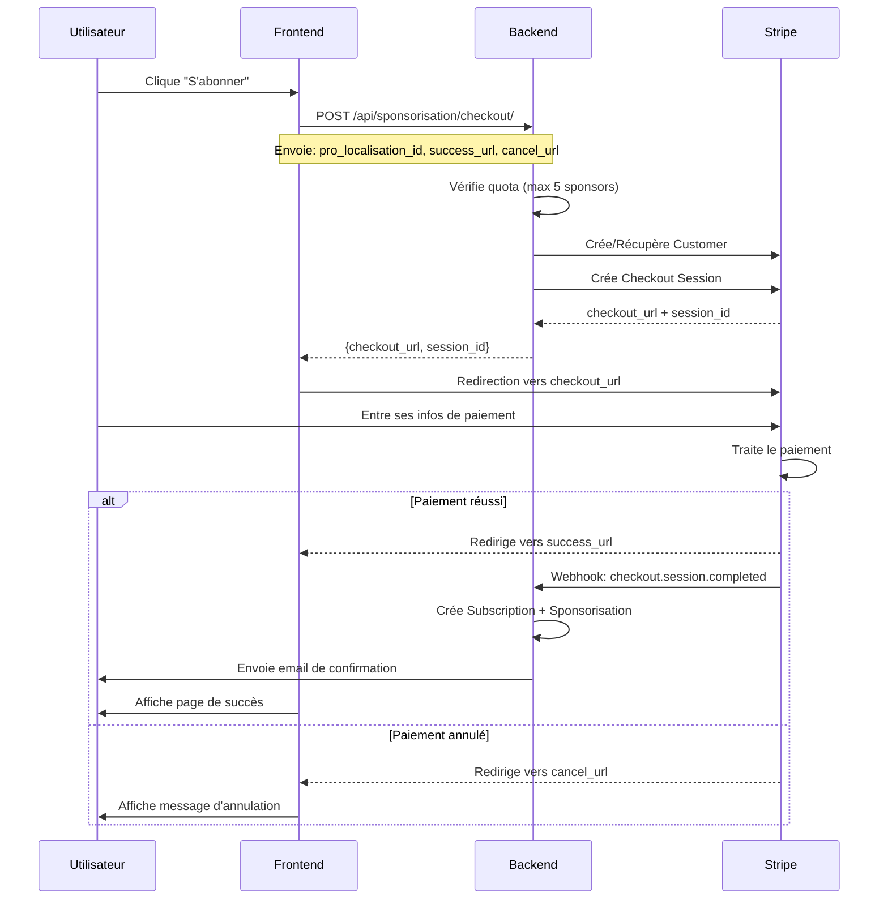

# 📘 Documentation API Stripe - Frontend Integration

## 🌐 Configuration Frontend

```javascript
// Configuration de base
const API_BASE_URL = "https://api.fox-reviews.com";
const FRONTEND_URL = "https://fox-reviews.com/#/client/";

// Les URLs utilisées pour les redirections Stripe
const STRIPE_SUCCESS_URL = `${FRONTEND_URL}billing/success`;
const STRIPE_CANCEL_URL = `${FRONTEND_URL}billing/cancel`;
const STRIPE_RETURN_URL = `${FRONTEND_URL}account/billing`;
```

## 🎯 Endpoints Frontend

Le frontend ne gère **QUE** :
1. ✅ L'envoi des clés (UUIDs, URLs de redirection)
2. ✅ La redirection vers Stripe Checkout
3. ✅ L'affichage des données reçues

**IMPORTANT** : Tout le traitement métier (création Customer, validation quota, webhooks) est géré côté backend.

---

## 1️⃣ Créer une session de paiement

### 🔗 Endpoint
```
POST /api/sponsorisation/checkout/
```

### 🔐 Authentification
```javascript
headers: {
  'Authorization': 'Token <access_token>',
  'Content-Type': 'application/json'
}
```

### 📤 Request Body
```json
{
  "pro_localisation_id": "uuid-de-la-pro-localisation",
  "duration_months": 1,
  "success_url": "https://fox-reviews.com/#/client/billing/success",
  "cancel_url": "https://fox-reviews.com/#/client/billing/cancel"
}
```

**Détails des paramètres** :
| Paramètre | Type | Requis | Description |
|-----------|------|--------|-------------|
| `pro_localisation_id` | UUID | ✅ | ID de la ProLocalisation à sponsoriser |
| `duration_months` | Integer | ❌ | Durée en mois (défaut: 1, min: 1, max: 12) |
| `success_url` | String (URL) | ✅ | URL de redirection après paiement réussi |
| `cancel_url` | String (URL) | ✅ | URL de redirection si l'utilisateur annule |

### ✅ Response Success (200)
```json
{
  "checkout_url": "https://checkout.stripe.com/c/pay/cs_test_...",
  "session_id": "cs_test_a1b2c3d4e5f6..."
}
```

**Actions Frontend** :
```javascript
// Rediriger l'utilisateur vers Stripe
window.location.href = response.checkout_url;

// OU avec Stripe.js (recommandé)
const stripe = Stripe('pk_live_...');
stripe.redirectToCheckout({ sessionId: response.session_id });
```

### ❌ Erreurs possibles

#### 400 - Paramètres manquants
```json
{
  "error": "Paramètres manquants"
}
```

#### 403 - Quota atteint
```json
{
  "error": "Limite de 5 sponsors atteinte pour ce triplet"
}
```

#### 404 - ProLocalisation introuvable
```json
{
  "error": "ProLocalisation introuvable"
}
```

#### 500 - Erreur Stripe
```json
{
  "error": "Erreur Stripe: <message détaillé>"
}
```

### 📱 Exemple d'intégration Vue.js/React

```javascript
// Vue.js
async createCheckoutSession(proLocalisationId) {
  try {
    this.loading = true;
    
    const response = await axios.post(
      `${API_BASE_URL}/api/sponsorisation/checkout/`,
      {
        pro_localisation_id: proLocalisationId,
        duration_months: 1,
        success_url: `${FRONTEND_URL}billing/success`,
        cancel_url: `${FRONTEND_URL}billing/cancel`
      },
      {
        headers: {
          'Authorization': `Token ${this.accessToken}`
        }
      }
    );
    
    // Redirection vers Stripe
    window.location.href = response.data.checkout_url;
    
  } catch (error) {
    if (error.response) {
      // Gérer les erreurs
      switch (error.response.status) {
        case 403:
          this.$notify.error('Limite de sponsors atteinte');
          break;
        case 404:
          this.$notify.error('Localisation non trouvée');
          break;
        default:
          this.$notify.error(error.response.data.error || 'Erreur lors de la création du paiement');
      }
    }
  } finally {
    this.loading = false;
  }
}
```

---

## 2️⃣ Accéder au Customer Portal Stripe

### 🔗 Endpoint
```
POST /api/billing/portal/
```

### 🔐 Authentification
```javascript
headers: {
  'Authorization': 'Token <access_token>',
  'Content-Type': 'application/json'
}
```

### 📤 Request Body
```json
{
  "return_url": "https://fox-reviews.com/#/client/account/billing"
}
```

**Détails des paramètres** :
| Paramètre | Type | Requis | Description |
|-----------|------|--------|-------------|
| `return_url` | String (URL) | ❌ | URL de retour depuis le Customer Portal (défaut: page d'accueil) |

### ✅ Response Success (200)
```json
{
  "url": "https://billing.stripe.com/p/session/test_..."
}
```

**Actions Frontend** :
```javascript
// Rediriger vers le Customer Portal
window.location.href = response.url;
```

### ❌ Erreurs possibles

#### 400 - Aucun compte Stripe
```json
{
  "error": "Aucun compte Stripe associé"
}
```

#### 404 - Entreprise non trouvée
```json
{
  "error": "Aucune entreprise trouvée"
}
```

#### 500 - Erreur Stripe
```json
{
  "error": "Erreur Stripe: <message>"
}
```

### 📱 Exemple d'intégration

```javascript
// Vue.js/React
async openCustomerPortal() {
  try {
    const response = await axios.post(
      `${API_BASE_URL}/api/billing/portal/`,
      {
        return_url: `${FRONTEND_URL}account/billing`
      },
      {
        headers: {
          'Authorization': `Token ${this.accessToken}`
        }
      }
    );
    
    // Redirection vers le Customer Portal
    window.location.href = response.data.url;
    
  } catch (error) {
    if (error.response?.status === 400) {
      this.$notify.warning('Vous n\'avez pas encore d\'abonnement actif');
    } else {
      this.$notify.error('Erreur lors de l\'accès au portail client');
    }
  }
}
```

---

## 3️⃣ Lister les abonnements

### 🔗 Endpoint
```
GET /api/billing/api/subscriptions/
```

### 🔐 Authentification
```javascript
headers: {
  'Authorization': 'Token <access_token>'
}
```

### 📤 Request Body
```
Aucun (GET request)
```

### ✅ Response Success (200)
```json
[
  {
    "id": 1,
    "entreprise_nom": "Mon Entreprise SAS",
    "pro_localisation_info": {
      "sous_categorie": "Plomberie",
      "ville": "Paris"
    },
    "status": "active",
    "amount": 20.00,
    "currency": "eur",
    "current_period_start": "2025-12-01T00:00:00Z",
    "current_period_end": "2026-01-01T00:00:00Z",
    "cancel_at_period_end": false,
    "canceled_at": null,
    "created_at": "2025-12-01T10:30:00Z"
  }
]
```

**Détails des champs** :
| Champ | Type | Description |
|-------|------|-------------|
| `id` | Integer | ID interne de l'abonnement |
| `entreprise_nom` | String | Nom de l'entreprise |
| `pro_localisation_info` | Object | Catégorie et ville sponsorisées |
| `status` | String | `active`, `past_due`, `canceled`, `unpaid` |
| `amount` | Decimal | Montant mensuel HT |
| `currency` | String | Devise (`eur`) |
| `current_period_start` | DateTime | Début de la période actuelle |
| `current_period_end` | DateTime | Fin de la période actuelle (prochain paiement) |
| `cancel_at_period_end` | Boolean | Annulation programmée en fin de période |
| `canceled_at` | DateTime | Date d'annulation (si annulé) |
| `created_at` | DateTime | Date de création |

### ❌ Erreurs possibles

#### 404 - Aucune entreprise
```json
{
  "error": "Aucune entreprise trouvée"
}
```

#### 500 - Erreur serveur
```json
{
  "error": "<message d'erreur>"
}
```

### 📱 Exemple d'intégration

```javascript
// Vue.js
async fetchSubscriptions() {
  try {
    const response = await axios.get(
      `${API_BASE_URL}/api/billing/api/subscriptions/`,
      {
        headers: {
          'Authorization': `Token ${this.accessToken}`
        }
      }
    );
    
    this.subscriptions = response.data;
    
    // Afficher les abonnements actifs
    this.activeSubscriptions = this.subscriptions.filter(
      sub => sub.status === 'active'
    );
    
  } catch (error) {
    console.error('Erreur lors du chargement des abonnements:', error);
  }
}
```

---

## 4️⃣ Détails d'un abonnement

### 🔗 Endpoint
```
GET /api/billing/api/subscriptions/<subscription_id>/
```

### 🔐 Authentification
```javascript
headers: {
  'Authorization': 'Token <access_token>'
}
```

### 📤 Request Body
```
Aucun (GET request)
```

### ✅ Response Success (200)
```json
{
  "id": 1,
  "entreprise_nom": "Mon Entreprise SAS",
  "pro_localisation_info": {
    "sous_categorie": "Plomberie",
    "ville": "Paris"
  },
  "status": "active",
  "amount": 20.00,
  "currency": "eur",
  "current_period_start": "2025-12-01T00:00:00Z",
  "current_period_end": "2026-01-01T00:00:00Z",
  "cancel_at_period_end": false,
  "canceled_at": null,
  "created_at": "2025-12-01T10:30:00Z"
}
```

### ❌ Erreurs possibles

#### 404 - Abonnement non trouvé
```json
{
  "error": "Abonnement non trouvé"
}
```

---

## 5️⃣ Lister les factures

### 🔗 Endpoint
```
GET /api/billing/api/invoices/
```

### 🔐 Authentification
```javascript
headers: {
  'Authorization': 'Token <access_token>'
}
```

### 📤 Request Body
```
Aucun (GET request)
```

### ✅ Response Success (200)
```json
[
  {
    "id": 1,
    "invoice_number": "INV-2025-001",
    "status": "paid",
    "amount_due": 20.00,
    "amount_paid": 20.00,
    "currency": "eur",
    "period_start": "2025-12-01T00:00:00Z",
    "period_end": "2026-01-01T00:00:00Z",
    "due_date": "2026-01-08T00:00:00Z",
    "invoice_pdf": "https://pay.stripe.com/invoice/acct_xxx/test_xxx/pdf",
    "hosted_invoice_url": "https://invoice.stripe.com/i/acct_xxx/test_xxx",
    "created_at": "2025-12-01T10:30:00Z"
  }
]
```

**Détails des champs** :
| Champ | Type | Description |
|-------|------|-------------|
| `id` | Integer | ID interne de la facture |
| `invoice_number` | String | Numéro de facture Stripe |
| `status` | String | `draft`, `open`, `paid`, `void`, `uncollectible` |
| `amount_due` | Decimal | Montant dû HT |
| `amount_paid` | Decimal | Montant payé HT |
| `currency` | String | Devise (`eur`) |
| `period_start` | DateTime | Début de la période facturée |
| `period_end` | DateTime | Fin de la période facturée |
| `due_date` | DateTime | Date d'échéance |
| `invoice_pdf` | String (URL) | Lien pour télécharger le PDF |
| `hosted_invoice_url` | String (URL) | Page de paiement Stripe |
| `created_at` | DateTime | Date de création |

### 📱 Exemple d'intégration

```javascript
// Vue.js - Composant de liste de factures
async fetchInvoices() {
  try {
    const response = await axios.get(
      `${API_BASE_URL}/api/billing/api/invoices/`,
      {
        headers: {
          'Authorization': `Token ${this.accessToken}`
        }
      }
    );
    
    this.invoices = response.data;
    
  } catch (error) {
    console.error('Erreur lors du chargement des factures:', error);
  }
},

downloadInvoice(invoice) {
  // Ouvrir le PDF dans un nouvel onglet
  window.open(invoice.invoice_pdf, '_blank');
}
```

---

## 6️⃣ Détails d'une facture

### 🔗 Endpoint
```
GET /api/billing/api/invoices/<invoice_id>/
```

### 🔐 Authentification
```javascript
headers: {
  'Authorization': 'Token <access_token>'
}
```

### ✅ Response Success (200)
```json
{
  "id": 1,
  "invoice_number": "INV-2025-001",
  "status": "paid",
  "amount_due": 20.00,
  "amount_paid": 20.00,
  "currency": "eur",
  "period_start": "2025-12-01T00:00:00Z",
  "period_end": "2026-01-01T00:00:00Z",
  "due_date": "2026-01-08T00:00:00Z",
  "invoice_pdf": "https://pay.stripe.com/invoice/acct_xxx/test_xxx/pdf",
  "hosted_invoice_url": "https://invoice.stripe.com/i/acct_xxx/test_xxx",
  "created_at": "2025-12-01T10:30:00Z"
}
```

### ❌ Erreurs possibles

#### 404 - Facture non trouvée
```json
{
  "error": "Facture non trouvée"
}
```

---

## 🔄 Flux complet d'un paiement



---

## 🎨 Composants Frontend recommandés

### Composant: Bouton d'abonnement

```vue
<template>
  <button 
    @click="subscribe" 
    :disabled="loading || quotaReached"
    class="btn-subscribe"
  >
    <span v-if="loading">⏳ Chargement...</span>
    <span v-else-if="quotaReached">🚫 Limite atteinte</span>
    <span v-else>💳 S'abonner (20€ HT/mois)</span>
  </button>
</template>

<script>
export default {
  props: ['proLocalisationId'],
  data() {
    return {
      loading: false,
      quotaReached: false
    }
  },
  methods: {
    async subscribe() {
      this.loading = true;
      try {
        const response = await this.$api.post('/api/sponsorisation/checkout/', {
          pro_localisation_id: this.proLocalisationId,
          duration_months: 1,
          success_url: `${window.location.origin}/#/client/billing/success`,
          cancel_url: `${window.location.origin}/#/client/billing/cancel`
        });
        
        window.location.href = response.data.checkout_url;
      } catch (error) {
        if (error.response?.status === 403) {
          this.quotaReached = true;
          this.$notify.error('Limite de 5 sponsors atteinte pour cette catégorie/ville');
        }
      } finally {
        this.loading = false;
      }
    }
  }
}
</script>
```

### Composant: Liste d'abonnements

```vue
<template>
  <div class="subscriptions-list">
    <div v-for="sub in subscriptions" :key="sub.id" class="subscription-card">
      <div class="sub-header">
        <h3>{{ sub.pro_localisation_info.sous_categorie }}</h3>
        <span :class="`badge badge-${sub.status}`">{{ getStatusLabel(sub.status) }}</span>
      </div>
      
      <div class="sub-details">
        <p>📍 {{ sub.pro_localisation_info.ville }}</p>
        <p>💰 {{ sub.amount }}€ HT/mois</p>
        <p>📅 Prochain paiement: {{ formatDate(sub.current_period_end) }}</p>
      </div>
      
      <button @click="openPortal" class="btn-manage">
        ⚙️ Gérer mon abonnement
      </button>
    </div>
  </div>
</template>

<script>
export default {
  data() {
    return {
      subscriptions: []
    }
  },
  mounted() {
    this.fetchSubscriptions();
  },
  methods: {
    async fetchSubscriptions() {
      const response = await this.$api.get('/api/billing/api/subscriptions/');
      this.subscriptions = response.data;
    },
    
    async openPortal() {
      const response = await this.$api.post('/api/billing/portal/', {
        return_url: `${window.location.origin}/#/client/account/billing`
      });
      window.location.href = response.data.url;
    },
    
    getStatusLabel(status) {
      const labels = {
        'active': 'Actif',
        'past_due': 'En retard',
        'canceled': 'Annulé',
        'unpaid': 'Impayé'
      };
      return labels[status] || status;
    },
    
    formatDate(dateString) {
      return new Date(dateString).toLocaleDateString('fr-FR');
    }
  }
}
</script>
```

---

## 🔐 Gestion de l'authentification

```javascript
// axios-instance.js
import axios from 'axios';

const api = axios.create({
  baseURL: 'https://api.fox-reviews.com',
  headers: {
    'Content-Type': 'application/json'
  }
});

// Intercepteur pour ajouter le token
api.interceptors.request.use(
  config => {
    const token = localStorage.getItem('access_token');
    if (token) {
      config.headers.Authorization = `Token ${token}`;
    }
    return config;
  },
  error => Promise.reject(error)
);

// Intercepteur pour gérer les erreurs
api.interceptors.response.use(
  response => response,
  error => {
    if (error.response?.status === 401) {
      // Token expiré, rediriger vers login
      window.location.href = '/#/login';
    }
    return Promise.reject(error);
  }
);

export default api;
```

---

## 📊 Récapitulatif des endpoints

| Endpoint | Méthode | Auth | Rôle Frontend |
|----------|---------|------|---------------|
| `/api/sponsorisation/checkout/` | POST | ✅ | Envoie `pro_localisation_id` + URLs → Reçoit `checkout_url` → Redirige |
| `/api/billing/portal/` | POST | ✅ | Envoie `return_url` → Reçoit `url` → Redirige vers Customer Portal |
| `/api/billing/api/subscriptions/` | GET | ✅ | Affiche liste des abonnements |
| `/api/billing/api/subscriptions/<id>/` | GET | ✅ | Affiche détails d'un abonnement |
| `/api/billing/api/invoices/` | GET | ✅ | Affiche liste des factures |
| `/api/billing/api/invoices/<id>/` | GET | ✅ | Affiche détails d'une facture |

---

## 🎯 Responsabilités

### ✅ Frontend (Vue.js/React)
- Collecter l'UUID de la `ProLocalisation`
- Construire les URLs de redirection basées sur `FRONTEND_URL`
- Envoyer les requêtes aux endpoints backend
- Rediriger l'utilisateur vers Stripe
- Afficher les données des abonnements/factures

### ✅ Backend (Django)
- Valider les quotas (max 5 sponsors)
- Créer/récupérer le Stripe Customer
- Créer la Checkout Session avec le Price ID configuré (20€ HT)
- Gérer les webhooks Stripe
- Créer les objets Subscription et Sponsorisation
- Envoyer les emails de confirmation

### ✅ Stripe
- Gérer le paiement sécurisé
- Gérer les abonnements récurrents
- Envoyer les webhooks au backend
- Fournir le Customer Portal

---

## 💡 Notes importantes

1. **FRONTEND_URL** est utilisé uniquement pour :
   - Construire `success_url` et `cancel_url` dans les requêtes
   - Construire `return_url` pour le Customer Portal
   
2. **Le frontend ne stocke jamais** :
   - Les clés secrètes Stripe
   - Les détails de paiement
   - Les informations sensibles
   
3. **Toute la logique métier est backend** :
   - Création de Customer
   - Validation des quotas
   - Gestion des abonnements
   - Envoi d'emails
   
4. **Les webhooks sont automatiques** :
   - Le frontend n'a pas à les gérer
   - Les statuts sont mis à jour automatiquement
   - Les emails sont envoyés automatiquement

5. **Prix configuré dans le backend** :
   - `STRIPE_SPONSORSHIP_PRICE_ID=price_...` (20€ HT)
   - Le frontend n'a pas à gérer les montants
