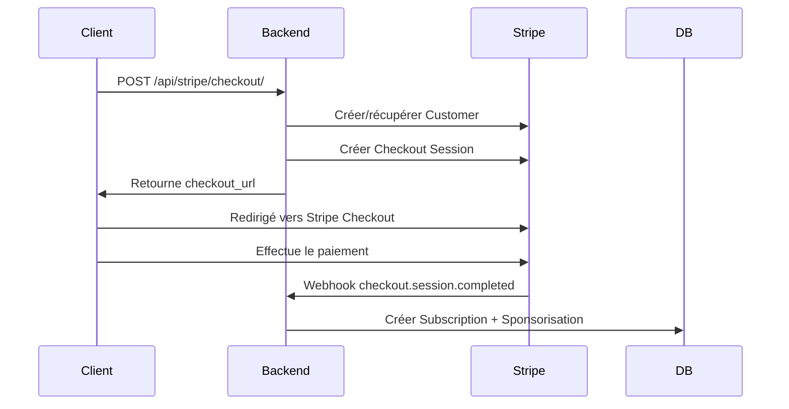

# Intégration Stripe - Abonnements Sponsorisation

## 📋 Vue d'ensemble

Cette intégration Stripe suit les **best practices officielles** pour les abonnements :
- ✅ Utilisation du **Stripe Customer** pour chaque entreprise
- ✅ **Checkout Session** pour le paiement initial
- ✅ **Customer Portal** pour la gestion de l'abonnement
- ✅ **Webhooks** pour la synchronisation automatique

Documentation officielle : https://docs.stripe.com/billing/subscriptions/build-subscriptions

## 🔧 Configuration

### 1. Variables d'environnement

Ajoutez dans votre `.env` :

```env
# Stripe Keys (Dashboard > Developers > API keys)
STRIPE_SECRET_KEY=sk_test_xxx
STRIPE_PUBLISHABLE_KEY=pk_test_xxx

# Webhook Secret (Dashboard > Developers > Webhooks)
STRIPE_WEBHOOK_SECRET=whsec_xxx

# Price ID (Dashboard > Products > Prix)
STRIPE_SPONSORSHIP_PRICE_ID=price_xxx
```

### 2. Créer un produit Stripe

#### Option A : Via le Dashboard (recommandé pour production)

1. Allez sur https://dashboard.stripe.com/products
2. Créez un produit "Sponsorisation"
3. Ajoutez un prix récurrent : **99€/mois**
4. Copiez le **Price ID** (format : `price_xxx`)
5. Ajoutez-le dans `STRIPE_SPONSORSHIP_PRICE_ID`

#### Option B : Création dynamique (dev/test)

Si `STRIPE_PRICE_ID` n'est pas défini, le code crée automatiquement le prix à chaque checkout.

### 3. Configurer les Webhooks

1. Dashboard > Developers > Webhooks > Add endpoint
2. URL : `https://votre-domaine.com/api/stripe/webhook/`
3. Événements à écouter :
   - `checkout.session.completed`
   - `invoice.payment_succeeded`
   - `invoice.payment_failed`
   - `customer.subscription.deleted`
   - `customer.subscription.updated`

4. Copiez le **Signing secret** dans `STRIPE_WEBHOOK_SECRET`

### 4. Activer le Customer Portal

1. Dashboard > Settings > Billing > Customer portal
2. Activez :
   - ✅ Voir factures
   - ✅ Mettre à jour mode de paiement
   - ✅ Annuler abonnement

## 🔄 Flow d'abonnement

### 1️⃣ Création de l'abonnement



**Appel API** :

```bash
POST /api/stripe/checkout/
Authorization: Bearer <token>
Content-Type: application/json

{
  "pro_localisation_id": "uuid-xxx",
  "duration_months": 1,
  "success_url": "https://app.com/success",
  "cancel_url": "https://app.com/cancel"
}
```

**Réponse** :

```json
{
  "checkout_url": "https://checkout.stripe.com/c/pay/cs_xxx",
  "session_id": "cs_xxx"
}
```

### 2️⃣ Gestion de l'abonnement (Customer Portal)

```bash
POST /api/stripe/customer-portal/
Authorization: Bearer <token>
Content-Type: application/json

{
  "return_url": "https://app.com/account"
}
```

**Réponse** :

```json
{
  "url": "https://billing.stripe.com/p/session/xxx"
}
```

Le client peut alors :
- 📄 Voir ses factures
- 💳 Mettre à jour son mode de paiement
- ❌ Annuler son abonnement

## 📡 Webhooks

### `checkout.session.completed`

**Déclenché** : Après paiement réussi du checkout

**Actions** :
1. Récupère la Stripe Subscription
2. Crée `Subscription` (Django)
3. Crée `Sponsorisation` (pour compatibilité)
4. Log de l'événement

### `invoice.payment_succeeded`

**Déclenché** : Renouvellement mensuel réussi

**Actions** :
1. Met à jour le statut `Subscription` → `active`
2. Crée `Invoice` (facture)
3. Prolonge la `Sponsorisation` de 30 jours
4. Envoie email de confirmation (TODO)

### `invoice.payment_failed`

**Déclenché** : Échec de paiement (carte expirée, refusée, etc.)

**Actions** :
1. Met à jour le statut `Subscription` → `past_due`
2. Crée `Invoice` avec status `open`
3. Met à jour `Sponsorisation` → `past_due`
4. Envoie email d'alerte (TODO)

### `customer.subscription.deleted`

**Déclenché** : Abonnement annulé (fin de période ou immédiat)

**Actions** :
1. Met à jour le statut `Subscription` → `canceled`
2. Désactive la `Sponsorisation`
3. Log de l'événement

## 🗂️ Modèles de données

### Subscription (nouveau système)

```python
class Subscription(BaseModel):
    entreprise = FK(Entreprise)
    pro_localisation = FK(ProLocalisation)
    stripe_customer_id = CharField  # cus_xxx
    stripe_subscription_id = CharField  # sub_xxx (unique)
    status = CharField  # active, past_due, canceled, etc.
    current_period_start = DateTimeField
    current_period_end = DateTimeField
    amount = DecimalField  # 99.00
    currency = CharField  # eur
```

### Invoice (factures)

```python
class Invoice(BaseModel):
    subscription = FK(Subscription)
    entreprise = FK(Entreprise)
    stripe_invoice_id = CharField  # in_xxx
    status = CharField  # paid, open, void
    amount_paid = DecimalField
    period_start = DateTimeField
    period_end = DateTimeField
    invoice_pdf = URLField
    hosted_invoice_url = URLField
```

### Entreprise (ajout champ Stripe)

```python
class Entreprise(BaseModel):
    # ... champs existants
    stripe_customer_id = CharField(blank=True)  # cus_xxx
```

## 🧪 Tests

### Test manuel du flow

1. **Créer un checkout** :
```bash
curl -X POST http://localhost:8000/api/stripe/checkout/ \
  -H "Authorization: Bearer <token>" \
  -H "Content-Type: application/json" \
  -d '{
    "pro_localisation_id": "uuid-xxx",
    "duration_months": 1,
    "success_url": "http://localhost:3000/success",
    "cancel_url": "http://localhost:3000/cancel"
  }'
```

2. **Visiter l'URL** retournée et compléter le paiement avec une carte test :
   - Carte : `4242 4242 4242 4242`
   - Date : `12/34`
   - CVC : `123`

3. **Vérifier** que le webhook `checkout.session.completed` a créé :
   - Une `Subscription` avec `status=active`
   - Une `Sponsorisation` avec `is_active=True`

4. **Accéder au Customer Portal** :
```bash
curl -X POST http://localhost:8000/api/stripe/customer-portal/ \
  -H "Authorization: Bearer <token>" \
  -H "Content-Type: application/json" \
  -d '{
    "return_url": "http://localhost:3000/account"
  }'
```

### Cartes de test Stripe

| Carte | Comportement |
|-------|-------------|
| `4242 4242 4242 4242` | Paiement réussi |
| `4000 0000 0000 0002` | Carte refusée |
| `4000 0000 0000 9995` | Fonds insuffisants |
| `4000 0025 0000 3155` | Authentification 3D Secure requise |

Plus de cartes : https://stripe.com/docs/testing

## 🔒 Sécurité

### Webhooks

✅ **Vérification de signature** :
```python
stripe.Webhook.construct_event(
    payload, 
    signature_header, 
    STRIPE_WEBHOOK_SECRET
)
```

❌ **Ne JAMAIS faire confiance aux données sans vérification**

### Idempotence

✅ Les webhooks peuvent être reçus plusieurs fois → toujours vérifier avant de créer des objets :

```python
Subscription.objects.get_or_create(
    stripe_subscription_id=sub_id,
    defaults={...}
)
```

## 📊 Monitoring

### Logs à surveiller

- ✅ Checkout créés
- ✅ Webhooks reçus et traités
- ⚠️ Paiements échoués
- ❌ Erreurs Stripe

### Métriques importantes

- Nombre d'abonnements actifs
- Taux de churn (annulations)
- Taux d'échec de paiement
- Revenus mensuels récurrents (MRR)

## 🚀 Production

### Checklist avant mise en production

- [ ] Remplacer les clés de test par les clés de production
- [ ] Configurer le webhook sur le domaine de production
- [ ] Créer le produit et prix en mode live
- [ ] Tester le flow complet en mode test
- [ ] Configurer les emails de notification
- [ ] Ajouter monitoring et alertes
- [ ] Documenter le processus de remboursement

### URLs importantes

- Dashboard Stripe : https://dashboard.stripe.com
- Documentation : https://stripe.com/docs
- Status Stripe : https://status.stripe.com

## 🆘 Dépannage

### Webhook non reçu

1. Vérifier que l'URL du webhook est accessible publiquement
2. Vérifier les logs Stripe Dashboard > Developers > Webhooks > Events
3. Tester manuellement via "Send test webhook"

### Paiement bloqué en `incomplete`

1. Vérifier que le customer a complété le 3D Secure
2. Vérifier que la carte n'est pas expirée
3. Consulter les logs d'erreur dans Stripe Dashboard

### Subscription non créée

1. Vérifier les logs du webhook
2. Vérifier que `STRIPE_WEBHOOK_SECRET` est correct
3. Consulter les erreurs dans les logs Django

## 📝 TODO

- [ ] Ajouter envoi d'emails de confirmation
- [ ] Ajouter envoi d'emails d'alerte (paiement échoué)
- [ ] Ajouter gestion des remboursements
- [ ] Ajouter métriques dans dashboard admin
- [ ] Ajouter tests automatisés
- [ ] Ajouter gestion des coupons/promotions
- [ ] Ajouter la redirection vers l'espace client après success
- [ ] Ajouter gestion des factures et des abonnements
